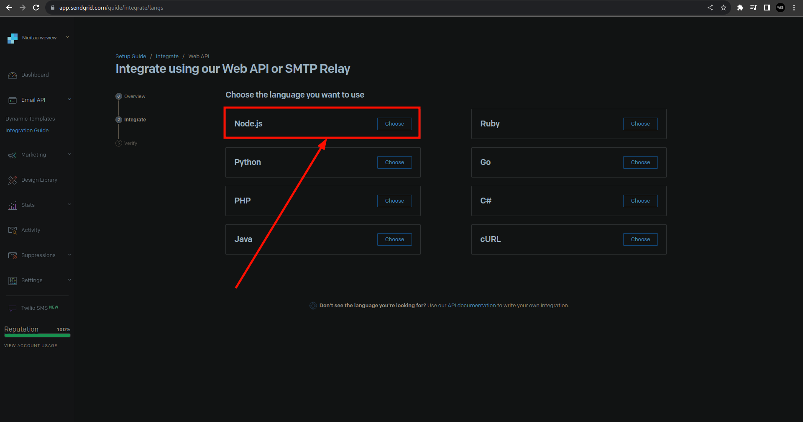

# What inside? <br/> <sub>https://22-aer-nicitaa.vercel.app/</sub>


<br/>
<br/>
<br/>
<hr/>

# Clone repository

## Step 1 - clone repository

### Step 1.1 - clone repository (variant 1)


### or Step 1.1 - clone repository (variant 2)

```
git clone https://github.com/Nicitaa/22_aer
```

### Step 1.2 - install deps

```
pnpm i
```

<br/>
<br/>

## Step 2 - setup .env (ca 25 mins)

### 2.1.1 - supabase (login in supabase - https://app.supabase.com/sign-in)


### 2.1.2 - supabase


### 2.1.3 - supabase


### 2.1.4 - supabase


### 2.1.5 - supabase


<hr/>
<br/>

### 2.2.1 - github (login in guthub - https://github.com/login)


### 2.2.2 - github


### 2.2.3 - github


### 2.2.4 - github


### 2.2.5 - github


### 2.2.6 - github


### 2.2.7 - github


<hr/>
<br/>

### 2.3.1 - google (login in google)


### 2.3.2 - google


### 2.3.3 - google


### 2.3.4 - google


### 2.3.5 - google


### 2.3.6 - google


### 2.3.7 - google


### 2.3.8 - google


### 2.3.9 - google


### 2.3.10 - google


### 2.3.11 - google


<hr/>
<br/>

### 2.4.1 - sendgrid (login in sendgrid - https://app.sendgrid.com/login)


### 2.4.2 - sendgrid (create a new sender - https://app.sendgrid.com/settings/sender_auth/senders)


### 2.4.3 - sendgrid


### 2.4.4 - sendgrid (confirm your sender https://mail.google.com/mail)

### 2.4.5 - sendgrid (go to integration guide)


### 2.4.6 - sendgrid


### 2.4.7 - sendgrid



### 2.4.8 - sendgrid


### 2.4.9 - sendgrid


### 2.4.10 - sendgrid

Waiting for sendgrid set up - than I can move on

### 2.4.11 - sendgrid

### 2.4.12 - sendgrid

### 2.22 - run command

```
prisma generate
```
